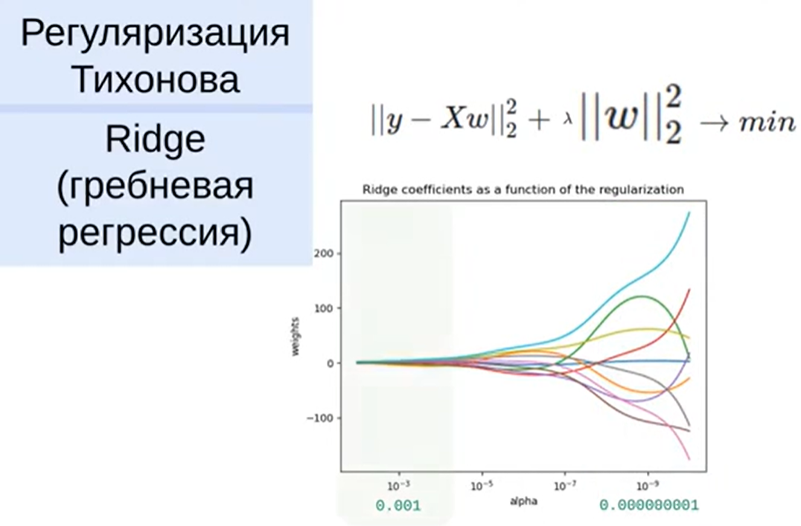
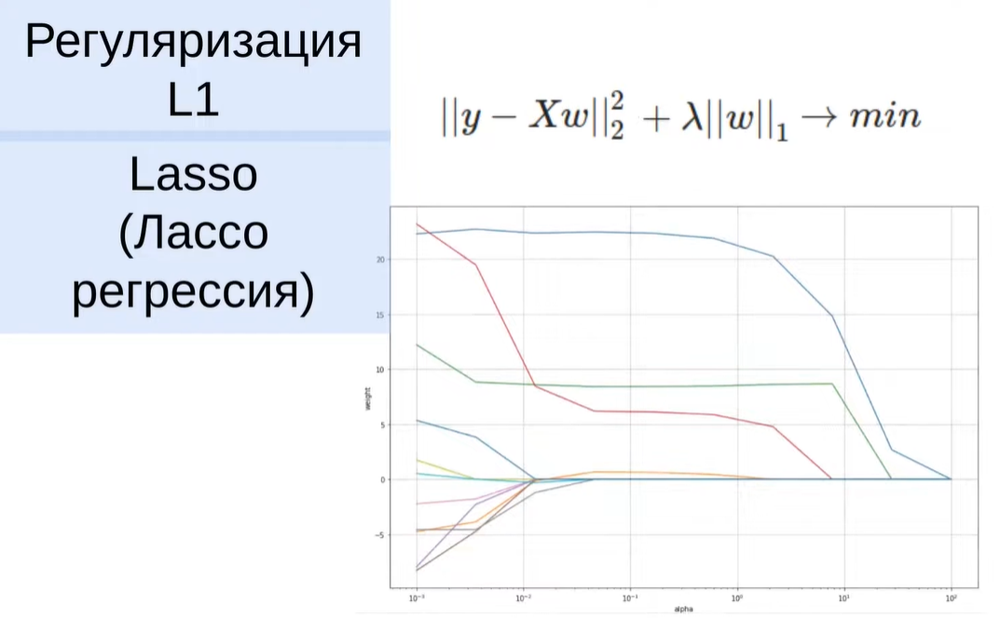
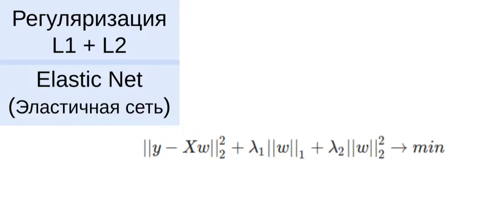

# Регуляризация в машинном обучении

Основная цель регуляризации — борьба с переобучением модели путем уменьшения её сложности. Переобученная модель имеет слишком большие веса, что приводит к излишней извилистости.

## Принцип работы

Принцип работы заключается в наложении штрафа на модель за излишнюю сложность.  
Сложность линейной модели измеряется величиной её весов.

## Виды регуляризации

### L2-регуляризация (Ридж, гребневая регрессия)

- Накладывает штраф на сумму квадратов весов  
- Уменьшает веса плавно и постепенно  
- Никогда не обнуляет веса полностью  

### L1-регуляризация (Лассо)

- Использует сумму модулей весов  
- Может обнулять веса, что позволяет отсеивать неинформативные признаки  
- Эффективна для отбора признаков  

### Elastic Net

- Комбинирует L1 и L2 регуляризации  
- Имеет параметры:
  - **alpha** — коэффициент регуляризации  
  - **ratio** — доля L1-регуляризации  

## Коэффициент регуляризации

Коэффициент регуляризации (λ / alpha) определяет строгость наказания модели:

- При слишком большом значении модель становится **недообученной**  
- При слишком малом — сохраняется **переобучение**  

Оптимальное значение подбирается по метрикам качества.

L2-регуляризация (Ridge) — формула и эффект
L1-регуляризация (Lasso) — формула и почему обнуляет веса
Когда использовать Ridge, а когда Lasso
Elastic Net — комбинация
Практика: RidgeCV(), LassoCV()