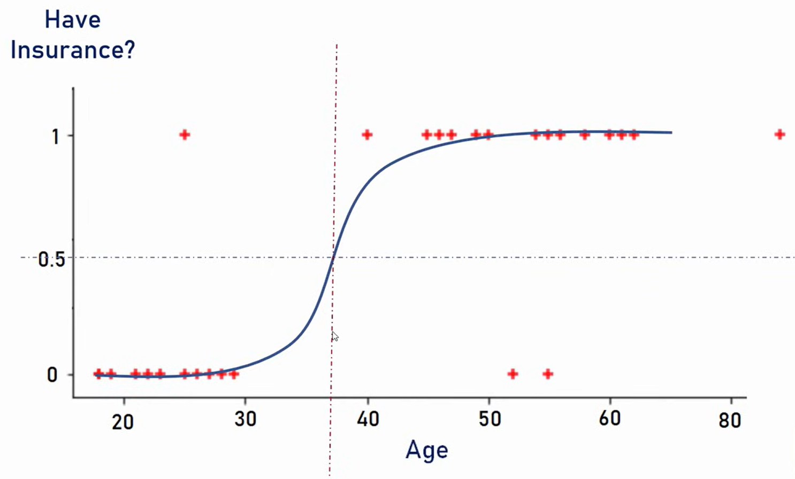
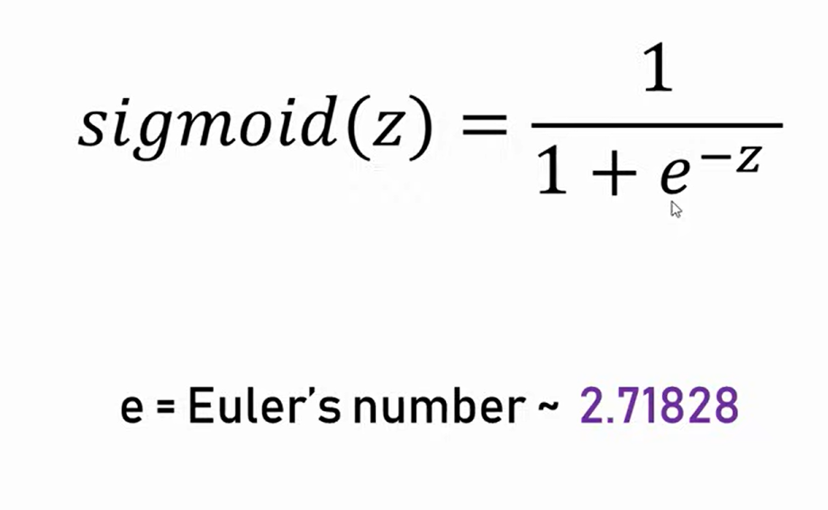
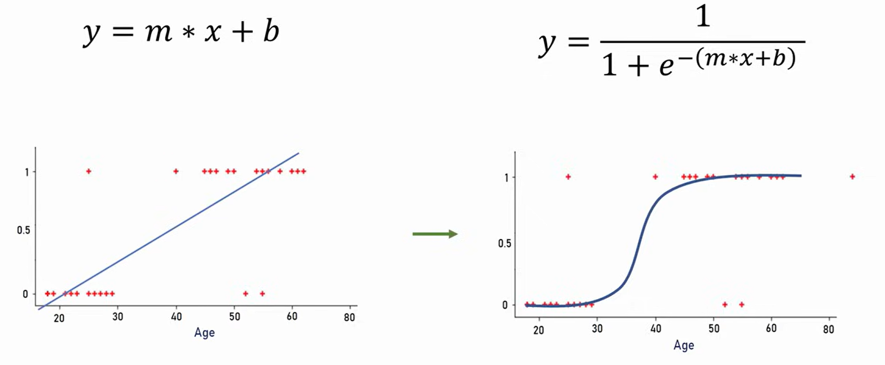

# Логистическая регрессия

## 1. Что это такое

Логистическая регрессия — это алгоритм машинного обучения для решения задач **классификации**, который предсказывает **вероятность принадлежности объекта к классу**.

Примеры задач:
- купит / не купит
- спам / не спам
- болен / здоров

---

## 2. Идея модели

Несмотря на название, это **линейная модель**.

Сначала считается линейная комбинация признаков:

z = w₀ + w₁x₁ + ... + wₙxₙ

Затем применяется сигмоидная функция:

σ(z) = 1 / (1 + e^{-z})

Итог:

y = σ(z)

---

## 3. Почему используется сигмоида

Линейная функция даёт значения от -∞ до +∞,  
но в классификации нужна вероятность (от 0 до 1).

Сигмоида:
- сжимает значения в диапазон [0, 1]
- позволяет интерпретировать результат как вероятность

---

## 4. Как принимается решение

После получения вероятности задаётся порог:

- p ≥ 0.5 → класс 1  
- p < 0.5 → класс 0  

(порог можно менять)

---

## 5. Связь с линейной регрессией

Логистическая регрессия строится на той же основе:

Общее:
- используется линейная комбинация признаков
- обучаются веса

Различие:
- в линейной регрессии: y = z  
- в логистической: y = σ(z)

Итог:
**логистическая регрессия = линейная модель + сигмоида**

---

## 6. Функция потерь

Используется логарифмическая функция потерь (Log Loss):

L = - (y log(p) + (1 - y) log(1 - p))

Почему не MSE:
- MSE плохо подходит для вероятностей
- делает обучение нестабильным

---

## 7. Обучение модели

Используется:
- градиентный спуск (Gradient Descent)

Модель подбирает веса w, чтобы минимизировать ошибку.

---

## 8. Типы логистической регрессии

- Бинарная — 2 класса  
- Многоклассовая (Multinomial)  
- One-vs-Rest (OvR) — разбиение на несколько бинарных задач  

---

## 9. Практическое использование

### sklearn

from sklearn.linear_model import LogisticRegression

model = LogisticRegression()

model.fit(X_train, y_train)

pred = model.predict(X_test)        # классы
proba = model.predict_proba(X_test) # вероятности

---

### основные параметры

- penalty: 'l1', 'l2' — регуляризация  
- C: сила регуляризации (обратная величина)  
- solver: алгоритм оптимизации ('liblinear', 'lbfgs')  
- max_iter: число итераций  

---

## 10. Когда использовать

Подходит, если:
- задача классификации  
- зависимость примерно линейная  
- нужна интерпретируемая модель  

---

## 11. Преимущества

- простота  
- быстрая работа  
- интерпретируемость (веса понятны)  
- даёт вероятности  

---

## 12. Недостатки

- плохо работает с нелинейными зависимостями  
- чувствительна к масштабированию признаков  
- требует подготовки данных  

---

## 13. Итог

Логистическая регрессия:
- строит линейную модель  
- преобразует её через сигмоиду  
- выдаёт вероятность класса  
- широко используется как базовый алгоритм классификации  