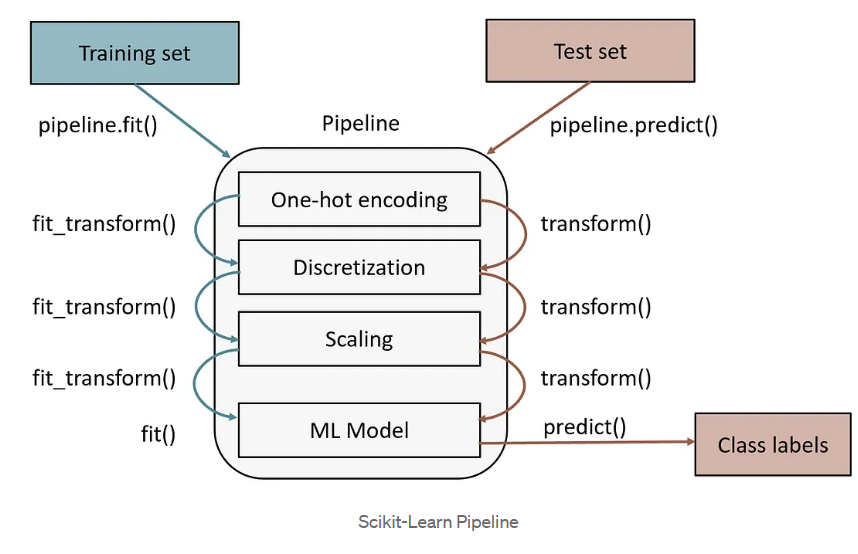

# Polyniminal features

*Полиномиальные признаки* — это способ расширить исходные признаки (features), добавляя их степени и комбинации, чтобы модель могла учитывать нелинейные зависимости.

---

## Идея
Если у тебя есть один признак:

    x

То полиномиальные признаки степени 2:

    x, x²

Для двух признаков:

    x₁, x₂

Полиномиальные признаки степени 2:

    x₁, x₂, x₁², x₂², x₁·x₂

Добавляется:
- степени признаков
- произведения признаков

---

## Зачем это нужно
Линейные модели (например, линейная регрессия) сами по себе строят только прямые линии.

Полиномиальные признаки позволяют:
- моделировать кривые зависимости
- улучшать качество модели без перехода к сложным алгоритмам

---

## Пример
Есть зависимость:

    y = x²

Линейная модель не справится.

Но если добавить признак `x²`, модель сможет выучить:

    y = w₁·x + w₂·x²

---

## Как создаются
Обычно задаётся:
- степень (degree), например 2 или 3
- учитывать ли только взаимодействия или ещё и степени

---

## Реализация в sklearn

В scikit-learn используется класс:

    from sklearn.preprocessing import PolynomialFeatures

### Пример

    import numpy as np
    from sklearn.preprocessing import PolynomialFeatures

    X = np.array([[2, 3]])

    poly = PolynomialFeatures(degree=2)
    X_poly = poly.fit_transform(X)

    print(X_poly)

Результат:

    [[1. 2. 3. 4. 6. 9.]]

Это:

    [1, x₁, x₂, x₁², x₁·x₂, x₂²]

---

### Основные параметры

    PolynomialFeatures(
        degree=2,
        interaction_only=False,
        include_bias=True
    )

- degree — степень полинома
- interaction_only:
  - False → степени и взаимодействия
  - True → только взаимодействия
- include_bias:
  - True → добавляется столбец из 1
  - False → нет

---

### Названия признаков

    poly.get_feature_names_out()

---

## Недостатки
1. Рост числа признаков
   - при большом количестве исходных фич → экспоненциальный рост

2. Переобучение (overfitting)
   - модель может слишком точно подстроиться под данные

3. Медленнее обучение

---

## Как бороться с проблемами
- ограничивать степень (обычно 2–3)
- использовать регуляризацию

---

## Кратко
Полиномиальные признаки:
- превращают линейную модель в нелинейную
- добавляют степени и комбинации признаков
- легко реализуются через sklearn
- улучшают качество, но могут привести к переобучению

---

## Pipeline

