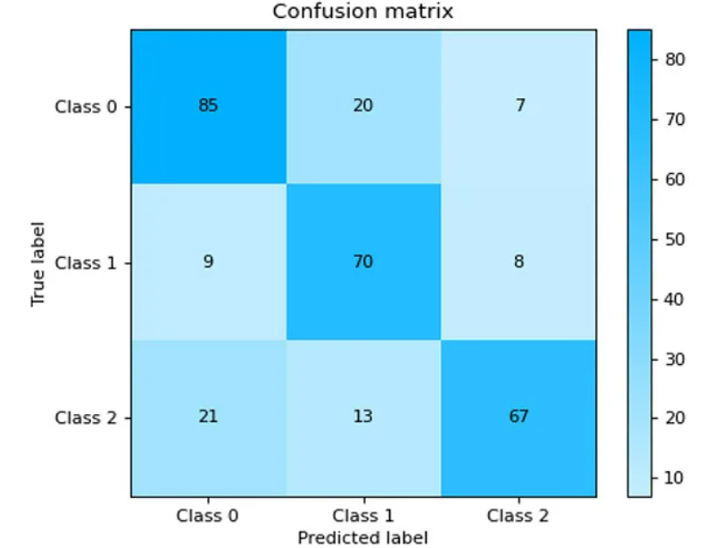
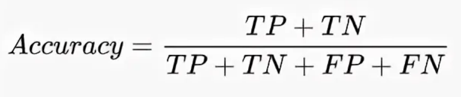
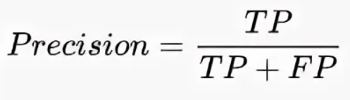
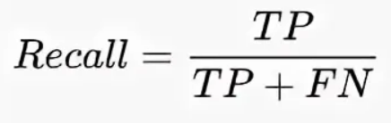
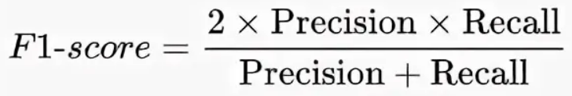
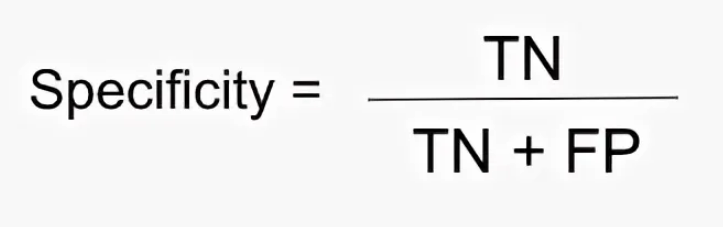
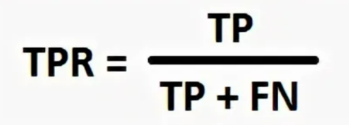
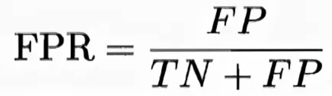

# Метрики классификации

## Матрица ошибок (TP, TN, FP, FN)

*TP* — истинно-положительные объекты ( True Positive) — объект представляет собой класс 1 и алгоритм его идентифицирует как класс 1

*FP* — ложно-положительные объекты ( False Positive) — объект представляет собой класс 0, алгоритм его идентифицирует как класс 1 (ошибается)

*TN* — истинно-отрицательные объекты ( True Negative) — объект представляет собой класс 0 и алгоритм его идентифицирует как класс 0

*FN* — ложно-отрицательные объекты ( False Negative) — объект представляет собой класс 1, алгоритм его идентифицирует как класс 0.

---

## Accuracy, Precision, Recall, F1-score

**Accuracy (точность)** — показывает долю правильных предсказаний модели среди всех предсказаний.

Интерпретация:
1. Показывает общее качество модели по всем классам.
2. Хорошо работает, когда данные сбалансированы (примеры разных классов распределены равномерно).
3. Если данные несбалансированы (например, один класс значительно преобладает), точность может быть обманчивой: если модель всегда предсказывает преобладающий класс, она может показать высокую точность, но при этом плохо работать на меньшем классе.

**Precision** — показывает, какая доля объектов, выделенных как положительные, действительно являются положительными.

Интерпретация:
1. Показывает, насколько надёжны предсказания положительного класса.
2. Высокая точность означает, что большинство объектов, отнесённых моделью к положительному классу, действительно принадлежат этому классу.
3. Важна в ситуациях, где важно минимизировать ложноположительные ошибки (FP), например, в диагностике болезней или фильтрации спама.

**Recall** — показывает, какая доля положительных объектов была правильно идентифицирована моделью.

Интерпретация:
1. Показывает, насколько хорошо модель находит все положительные примеры.
2. Высокая полнота означает, что модель редко пропускает положительные примеры (FN).
3. Важна в ситуациях, где важно минимизировать ложноотрицательные ошибки (FN), например, в диагностике серьёзных заболеваний, где важно найти всех больных пациентов.

**F1-Score** — гармоническое среднее между Precision и Recall, позволяющее сбалансировать их значения.

Интерпретация:
1. В отличие от простой точности (accuracy), F1-score учитывает как ложноположительные, так и ложноотрицательные результаты, что делает её особенно ценной для несбалансированных наборов данных.
2. Значение F1-score находится в диапазоне от 0 до 1, где: 0 — наихудший возможный результат, 1 — идеальная модель с безупречной точностью и полнотой.
3. При работе с многоклассовой классификацией F1-score вычисляется для каждого класса отдельно, а затем может быть агрегирован различными способами.

!

---

## Метрики для бинарной классификации

**Specificity, TPR (True Positive Rate) и FPR (False Positive Rate)** — это метрики, используемые для оценки качества бинарных классификационных моделей. Они помогают анализировать эффективность модели и её поведение при разных условиях.

**Specificity (также называется True Negative Rate, TNR)** — это доля верно предсказанных отрицательных примеров среди всех реальных отрицательных примеров. Она измеряет, насколько хорошо модель распознаёт отрицательный класс. 

Интерпретация:
Высокая специфичность означает, что модель редко ошибочно классифицирует отрицательные примеры как положительные. Эта метрика важна в задачах, где критично минимизировать ложноположительные ошибки.

**TPR (также называется чувствительностью или полнотой)** — это доля правильно предсказанных положительных классов от всех реальных положительных классов. 

Интерпретация:
TPR показывает, насколько хорошо модель выявляет положительные случаи. В медицинской диагностике это может быть способность теста правильно идентифицировать людей с заболеванием.
По сути - полнота положительных предсказаний (Recall).

**FPR (False Positive Rate)** — это доля ошибочно предсказанных положительных классов от всех реальных отрицательных классов. 

Интерпретация:
FPR показывает, как часто модель неверно прогнозирует наличие положительного класса среди отрицательных случаев. Например, в случае обнаружения рака это может быть доля доброкачественных образцов, ошибочно идентифицированных как раковые.

