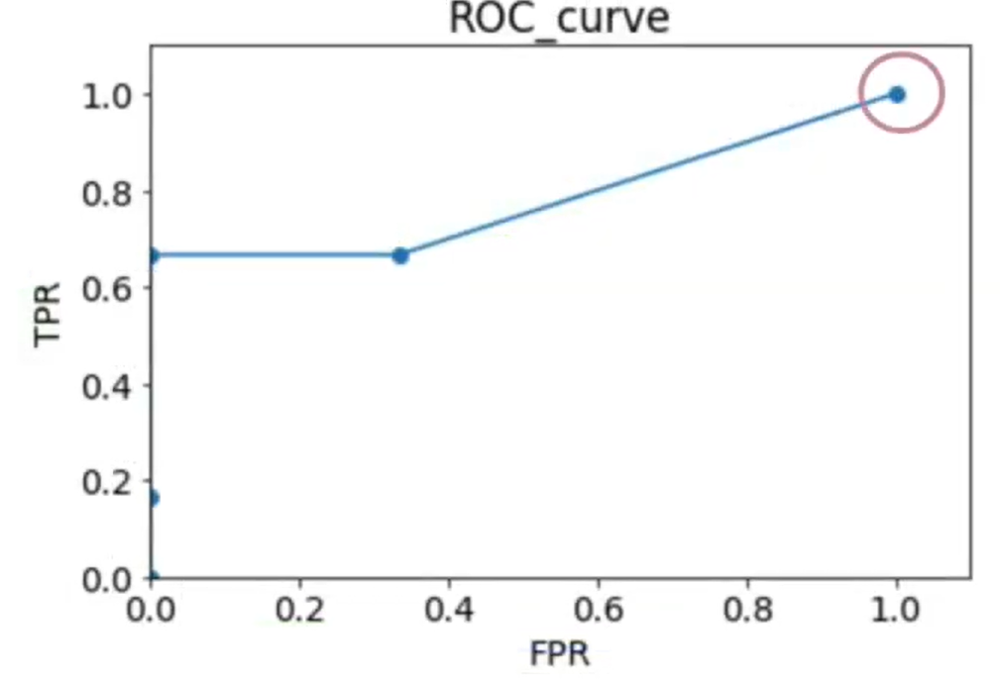

# ROC-AUC и PR-AUC

## 1. ROC-кривая (Receiver Operating Characteristic)

### Определение
ROC-кривая — это график, показывающий соотношение между **True Positive Rate (TPR)** и **False Positive Rate (FPR)** при варьировании порога решающего правила классификатора.

### Оси графика
*   **Ось Y (TPR)** = Sensitivity = Recall = \( \frac{TP}{TP + FN} \)
    *   *Способность находить все положительные объекты.*
*   **Ось X (FPR)** = Fall-out = \( \frac{FP}{FP + TN} \)
    *   *Доля отрицательных объектов, ошибочно принятых за положительные.*

### Построение
1.  Классификатор выдает вероятность принадлежности к классу 1.
2.  Сортируем объекты по убыванию вероятности.
3.  По очереди устанавливаем порог (от 1 до 0) и вычисляем TPR и FPR.
4.  Соединяем полученные точки.

### Свойства ROC-кривой
*   Диагональ \( y = x \) — это случайное угадывание (AUC = 0.5).
*   Точка (0,0) — порог = 1 (все объекты классифицированы как 0).
*   Точка (1,1) — порог = 0 (все объекты классифицированы как 1).
*   Идеальный классификатор: точка (0,1) — 100% TPR, 0% FPR.

---

## 2. AUC (Area Under Curve) — интерпретация

### Что это?
**AUC-ROC** — площадь под ROC-кривой. Число от 0 до 1.

### Как интерпретировать?

| AUC | Уровень качества |
|-----|------------------|
| 0.5 | Случайно |
| 0.6–0.7 | Плохо |
| 0.7–0.8 | Приемлемо |
| 0.8–0.9 | Хорошо |
| 0.9–1.0 | Отлично |

### Вероятностная интерпретация (главная)
> **AUC = вероятность того, что случайно выбранный положительный объект получит от классификатора более высокий ранг (более высокую вероятность класса 1), чем случайно выбранный отрицательный объект.**

*   Если AUC = 0.9: в 90% случаев положительный объект будет выше в упорядоченном списке, чем отрицательный.

### Свойства AUC
*   Не зависит от порога.
*   Устойчива к соотношению классов (в отличие от accuracy).
*   Инвариантна к монотонным преобразованиям выходов классификатора.
*   \( AUC = 1 \) — идеальное разделение классов.
*   \( AUC = 0 \) — классификатор всегда ошибается (меняем метки мест → получим 1).

---

## 3. PR-кривая (Precision-Recall)

### Определение
PR-кривая — график зависимости **Precision** (точность) от **Recall** (полнота) при изменении порога.

### Оси графика
*   **Ось Y (Precision)** = \( \frac{TP}{TP + FP} \)
    *   *Доля правильных ответов среди предсказанных положительных.*
*   **Ось X (Recall)** = \( \frac{TP}{TP + FN} \) (совпадает с TPR)

### Построение
Аналогично ROC, но вместо FPR используем Precision.

### Свойства PR-кривой
*   Базовый уровень — горизонтальная линия на уровне **Prevalence** (доля положительного класса).
*   Точка (0,1) — идеал (высокая полнота и точность одновременно).
*   PR-кривая **не** инвариантна к дисбалансу классов.
*   Может быть "зубчатой" — сглаживают или используют интерполяцию.

### PR-AUC (Average Precision, AP)
*   Площадь под PR-кривой.
*   Более информативна для редких классов.
*   Вычисляется часто как AP = \( \sum_n (R_n - R_{n-1}) P_n \).

---

## 4. Когда ROC-AUC обманывает? (Проблема сильного дисбаланса)

### Суть проблемы
При сильном дисбалансе (например, 99% отрицательных, 1% положительных) FPR меняется очень медленно, а TPR остается низким. ROC-кривая может выглядеть хорошо, но классификатор может быть бесполезен.

### Конкретный пример
*   Датасет: 1000 объектов (10 положительных, 990 отрицательных).
*   Классификатор предсказал: 9 из 10 положительных верно, но выдал 100 ложных срабатываний (FP).

**Вычисляем:**
*   TPR = 9/10 = 0.9 (отлично)
*   FPR = 100/990 ≈ 0.101 (мало)
*   **AUC-ROC** будет высоким (около 0.9).

**Но Precision:** 9 / (9 + 100) = 0.083 (ужасно).

### Почему ROC обманывает?
*   FPR знаменатель (TN + FP) огромен за счет TN. Даже большое FP дает небольшое изменение FPR.
*   ROC не чувствителен к абсолютному числу ложных срабатываний, только к их доле среди отрицательных.

### Что использовать вместо?
**PR-AUC** — она напрямую учитывает FP в знаменателе Precision.

| Метрика | Чувствительность к дисбалансу | Что показывает |
|---------|-------------------------------|----------------|
| ROC-AUC | Низкая (может быть обманчиво оптимистичной) | Ранжирование классов |
| PR-AUC | Высокая (жестко наказывает за FP при редком положительном классе) | Качество работы по положительному классу |

---

## 5. Практические рекомендации

### Когда использовать ROC-AUC?
*   Классы сбалансированы (0.3–0.7).
*   Важно общее ранжирование объектов без фиксации порога.
*   Сравнение моделей, когда цена FN и FP одинакова.

### Когда использовать PR-AUC?
*   **Сильный дисбаланс (меньше 10% положительных).**
*   Важен поиск редкого события (детекция мошенничества, поиск заболеваний, отток клиентов).
*   Ложные срабатывания (FP) критичны и их абсолютное число важно.

### Золотое правило
> **Если вам интересен именно положительный класс (а в дисбалансе это почти всегда так), смотрите на PR-AUC. ROC-AUC используйте как дополнительную, но не основную метрику.**

### Итоговая таблица

| Характеристика | ROC-AUC | PR-AUC |
|----------------|---------|--------|
| Зависимость от дисбаланса | Низкая | Высокая |
| Базовая линия (случайный) | 0.5 | Prevalence (доля положительных) |
| На что смотреть | Способность ранжировать | Точность по редкому классу |
| Когда вводит в заблуждение | Сильный дисбаланс | — |
| Интерпретируемость | Вероятность правильного ранжирования | Средняя Precision при данном Recall |

---

**Краткое резюме для запоминания:**  
*ROC-AUC* отвечает на вопрос: "Насколько хорошо модель разделяет классы в среднем?"  
*PR-AUC* отвечает на вопрос: "Насколько хорошо модель находит редкий положительный класс, не захлебываясь в ложных срабатываниях?"  
При дисбалансе — доверяй **PR-AUC**, проверяй **ROC-AUC**.

